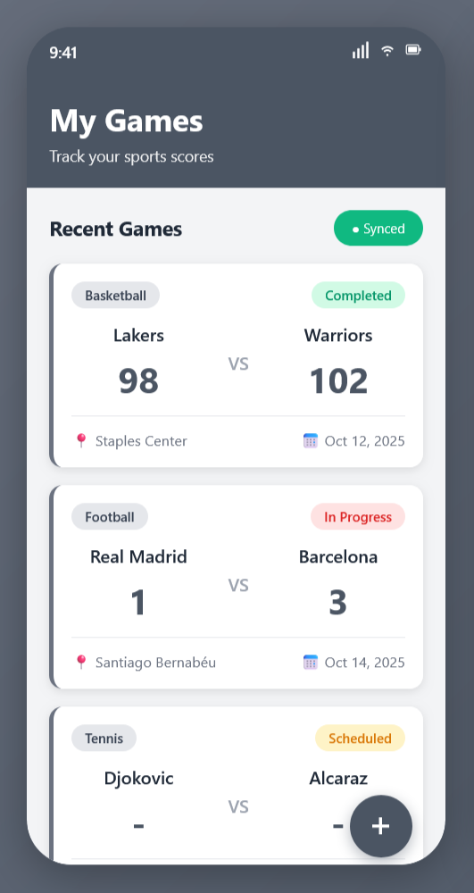
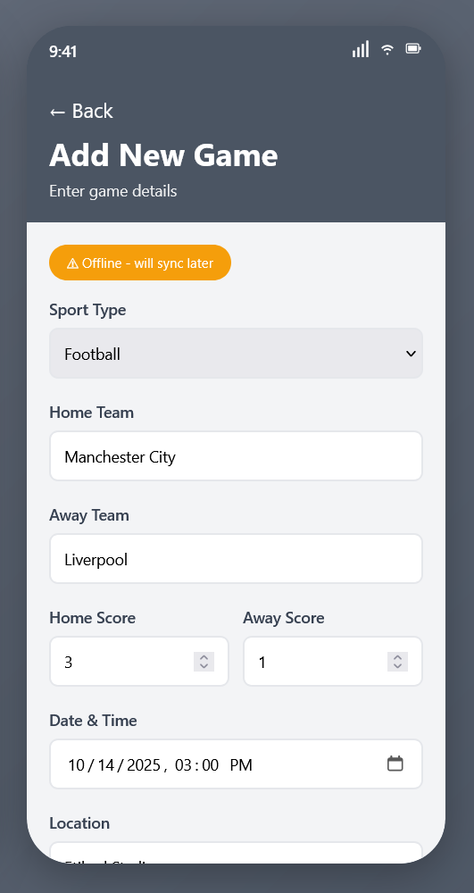

# Scorify

## Short Description

Scorify is a mobile application designed for sports enthusiasts who want to keep track of their favorite teams' games and scores in real-time. The app allows users to add games, record scores, track team statistics, and view historical match results even without an internet connection. Whether you're following local leagues or just want to maintain records of pickup games, this app provides an intuitive interface to manage all your sports data in one place.

## Domain Details

### Entity: Game

**Fields:**

1. **id** (Integer) - Unique identifier for the game
2. **homeTeam** (String) - Name of the home team
3. **awayTeam** (String) - Name of the away team
4. **homeScore** (Integer) - Score of the home team
5. **awayScore** (Integer) - Score of the away team
6. **date** (DateTime) - Date and time when the game was played
7. **location** (String) - Venue where the game takes place
8. **sportType** (String) - Type of sport (Basketball, Football, Tennis, etc.)
9. **status** (String) - Game status (Scheduled, In Progress, Completed, Cancelled)
10. **notes** (String) - Additional notes about the game

## CRUD Operations

### Create

Users can add a new game by entering team names, date, location, and sport type. The game is saved to the local database and synchronized with the server when online.

### Read

Users can view all games sorted by date. Each game shows team names, scores, date, and status. Tapping a game displays full details.

### Update

Users can edit games to update scores, change status, modify date/time, or add notes.

### Delete

Users can delete games from their list with a confirmation dialog.

## Persistence Details

**Local Database (SQLite):**

-   Create: Games are saved locally
-   Read: Games are loaded from local database
-   Update: Game changes are saved locally
-   Delete: Games are removed from local database

**Server:**

-   Create: Games are posted to the server via POST /api/games
-   Read: Games are fetched from the server via GET /api/games
-   Update: Game changes are sent to the server via PUT /api/games/{id}
-   Delete: Game deletions are sent to the server via DELETE /api/games/{id}

## Offline Access

### Create - Offline Scenario

When offline, the game is saved to the local database with a "pending sync" flag. When the device reconnects, the app automatically uploads the game to the server.

### Read - Offline Scenario

When offline, all games are loaded from the local database. Users can browse all previously synchronized games without internet connection.

### Update - Offline Scenario

When offline, updates are saved to the local database and marked as "pending sync". When connectivity restores, changes are pushed to the server.

### Delete - Offline Scenario

When offline, the game is marked as "deleted" locally. The deletion is queued for server sync. After successful server confirmation, the record is permanently removed.

## Screenshots

### Main Games List Screen

  

### Add/Edit Game Screen

